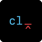
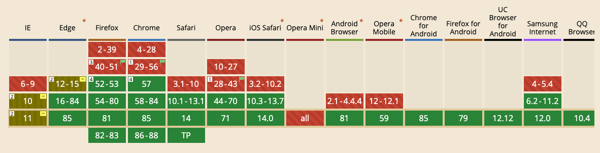

# School CSS Grid
A playground for testing out all new tech for school, such as homework & school assignments.
The goal of this project is to learn and understand CSS Grid, React Backend & Frontend fully so that I can implement it in coming school and work related projects.

## Table of contents

- [Quick start](#quick-start)
- [Status](#status)
- [What's included](#whats-included)
- [Bugs and feature requests](#bugs-and-feature-requests)
- [Contributing](#contributing)
- [Community](#community)
- [Versioning](#versioning)
- [Creator](#creator)
- [Copyright and license](#copyright-and-license)


## Quick start

### Download
Navigate the a directory on your computer were you are working on sites and run this command:
```shell
git clone https://github.com/bromso/school-projects.git
```

### Install packages
Navigate the site’s directory and run this command.
```shell
npm i
```

### Start developing
Navigate the site’s directory and start it up.
```shell
gatsby develop
```

### Local --> Stage --> Production

| Name                | Local                            | Stage		                  										 | Production                  										 |
|---------------------|----------------------------------|-------------------------------------------------|-------------------------------------------------|
| School Projects     | http://localhost:8000            |       																					 | https://bromso-schoolprojects.netlify.app/			 |

## Status
[](https://app.netlify.com/sites/bromso-schoolprojects/deploys)
[](https://david-dm.org/)

## What's included
### Dependencies
I recommended to have these CLI's and dependencies in order to download and install everything without a clitch.

| Logo                                                    | Name                                                                        | Comments																																		|
|---------------------------------------------------------|-----------------------------------------------------------------------------|-----------------------------------------------------------------------------|
|                  | [Homebrew](https://brew.sh/)                                                |	Package manager (for Mac)																										|
|                            | [NVM](https://github.com/nvm-sh/nvm)                                        |	Node & NPM Version Manager																									|
|                      | [NodeJS](https://nodejs.org/)                                               |	JavaScript Runtime Engine																										|
|                        | [NPMJS](https://www.npmjs.com/)                                             |	Node Page Manager																														|
| 			            | [GatsbyJS](https://www.gatsbyjs.com/)                                       |	Site Generator																															|

### Tech Stack
The application uses these technologies.

| Logo                                                    | Name                                                                        | Comments																																		|
|---------------------------------------------------------|-----------------------------------------------------------------------------|-----------------------------------------------------------------------------|
|                        | [HTML5](https://html.spec.whatwg.org/)																	    |	Markup language																															|
|                          | [CSS3](https://www.w3.org/TR/CSS/)				                                  |	Styling language																														|
|                        | [Husky](https://typicode.github.io/husky/)                                  |	Git message validator 																											|
|              | [Commitlint](https://commitlint.js.org/)                                    |	Git linter																																	|
|          | [Editorconfig](https://editorconfig.org/)                                   |	IDE coding styles																														|
|   | [Semantic Release](https://semantic-release.gitbook.io/semantic-release/)   |	Versioning tool																															|
|                  | [Prettier](https://prettier.io/)							                              |	Code formatter  																														|
|              		| [GatsbyJS](https://www.gatsbyjs.com/)                                    		|	Site generator																															|
|   									| [ReactJS](https://reactjs.org/)   																					|	JavaScript library																													|

### Hosting
The application uses these hosting vendors.

| Logo                                                     | Name                                                                        |Comments																																		 |
|----------------------------------------------------------|-----------------------------------------------------------------------------|-----------------------------------------------------------------------------|
|                       | [Github](https://github.com/)                                               | Code repository  																													 |
|                      | [Netlify](https://www.netlify.com/)                                         | Webpage hosting  																													 |

## Contributing
No contributions are necessary because the project is just for showing teacher at school.

## Bugs and feature requests
No bug and feature request are necessary because the project is just for showing teacher at school.

## Versioning
For transparency into my release cycle and in striving to maintain backward compatibility, school-projects is maintained under the [Semantic Versioning guidelines](https://semver.org). Sometimes I screw up, but I adhere to those rules whenever possible.

Always write a clear log message for your commits. One-line messages are fine for small changes, but bigger changes should look like this:

```sh
$ git commit -m "A brief summary of the commit
>
> A paragraph describing what changed and its impact."
```

| Type            | Explanation                                                    | Semver (eg. 1.0.0) | Git Message Example                              |
|-----------------|----------------------------------------------------------------|--------------------|--------------------------------------------------|
| fix             | A bug fix                                                      | x.x.1              | fix: update package.json                         |
| feat            | A new feature                                                  | x.1.x              | feat: add new eslint to package.json             |
| BREAKING CHANGE | A major change                                                 | 1.x.x              | BREAKING CHANGE: upgrade to strapi 3 & gatsby 3  |
| docs            | Documentation improvements                                     |                    | docs: update README.md                           |
| style           | Changes made white-space, formatting, missing semi-colons, etc |                    | style: add styles in breadcrumb component        |
| refactor        | A code change that neither fixes a bug nor adds a feature      |                    | refactor: fixed better intendation in index.html |
| perf            | Performance improvements                                       |                    | perf: add tree-shaking to webpack                |
| test            | Add missing tests                                              |                    | test: add test to .travis.yml                    |
| chore           | Changes the build process                                      |                    | chore: update .travis.yml & netlify.toml         |


See the Releases section of our GitHub project for [CHANGELOG](https://github.com/bromso/school-projects/blob/main/CHANGELOG.md) for each release version of MaterialUI projects.

## Creator
| Avatar                                                   | Name         | Email								   | Website																	|
|----------------------------------------------------------|--------------|------------------------|------------------------------------------|
|            | Jonas Bröms  | jonasbroms@icloud.com	 | [jonasbroms.com](https://jonasbroms.com)	|

## Coding conventions

- [Prettier](https://prettier.io/)
- [ESLint](https://eslint.org/)

## Copyright and license

This project is licensed under the terms of the MIT license.
For more information, [click here](https://github.com/bromso/school-projects/blob/master/LICENSE).

## Inspiration

### CSS Grid
#### Browser support


#### Libraries
- [Styled CSS Grid](https://github.com/azz/styled-css-grid)
- [React CSS Grid](https://github.com/jxnblk/react-css-grid)

#### Standards
- [W3C CSS Media Queries](https://www.w3schools.com/css/css_rwd_mediaqueries.asp)
- [W3C CSS HTML Examples](https://www.w3schools.com/html/html_examples.asp)
- [Mozilla CSS Grid layout](https://developer.mozilla.org/en-US/docs/Web/CSS/CSS_Grid_Layout)
- [W3C CSS Grid Layout Module 1](https://www.w3.org/TR/css-grid-1/)
- [Caniuse CSS Grid](https://caniuse.com/#feat=css-grid)

#### Education
- [Spring Into CSS Grid - Blog](https://jonitrythall.com/spring-into-css-grid)
- [CSS Tricks CSS Grid Complete Guide - Blog](https://css-tricks.com/snippets/css/complete-guide-grid/)
- [Grid by Example - Blog](https://gridbyexample.com/video/series-auto-fill-auto-fit/)
- [Leveluptuts CSS Grid - YouTube](https://youtu.be/NLLMwJwDgBs)

#### Frameworks & Themes
- [Grommet](https://v2.grommet.io/)
- [Styled CSS Grid](https://styled-css-grid.js.org/)

#### Resources
- [Most vector images used, Undraw](https://undraw.co/)
- [Most bitmap images used, Unsplash](https://unsplash.com/)
